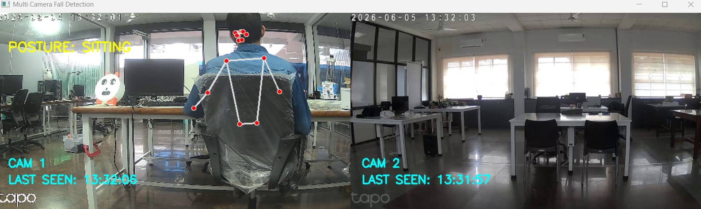
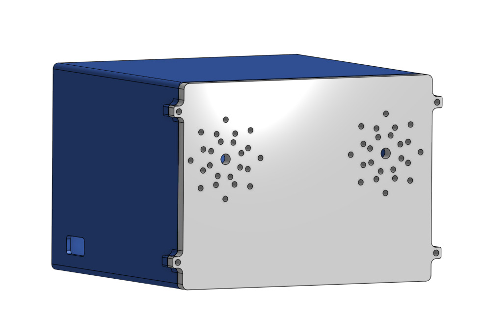
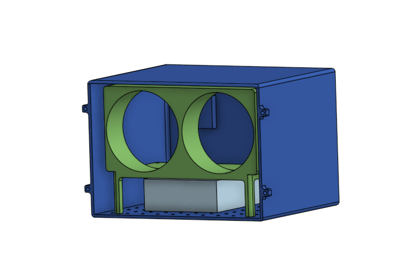
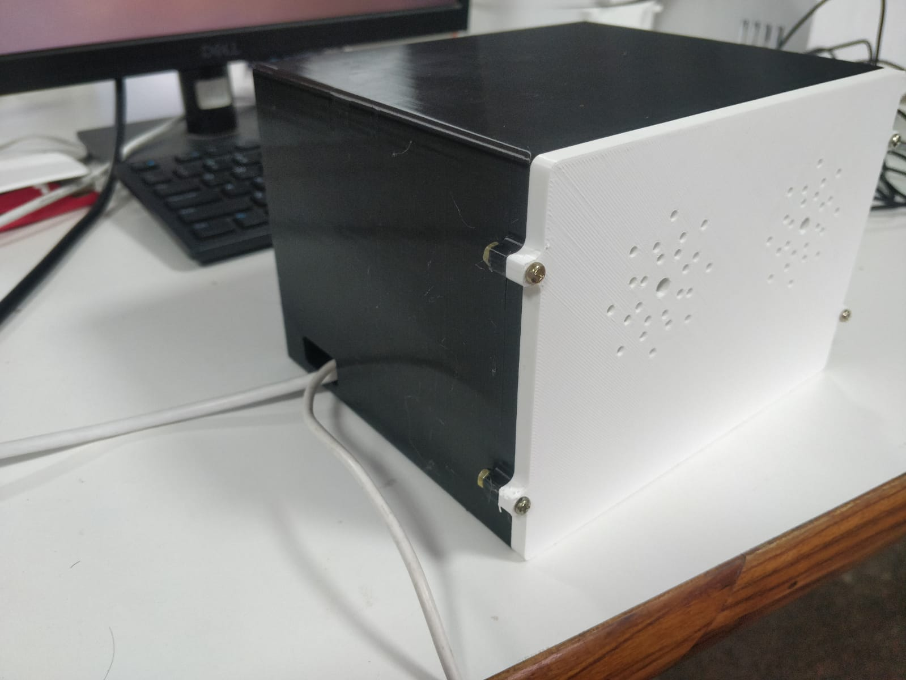
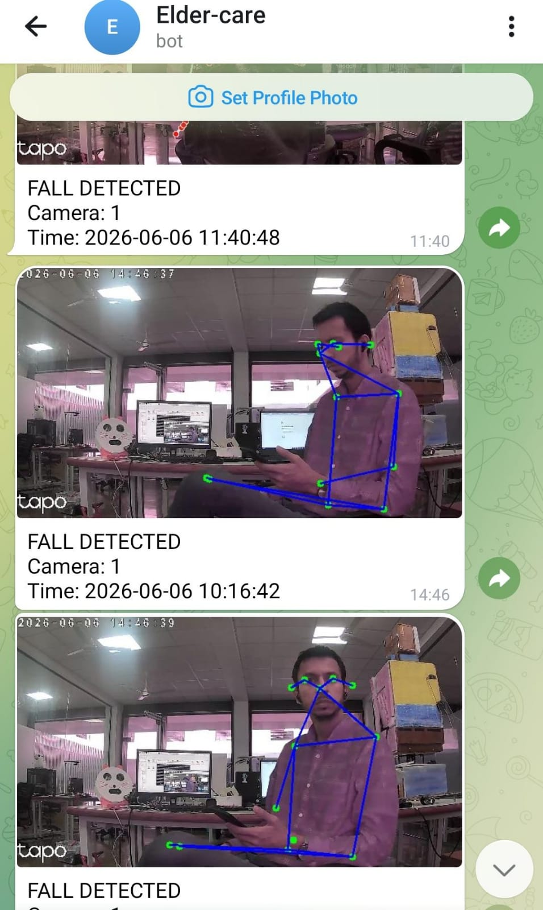

# Elder Fall Detection using Raspberry Pi 5, Multi Tapo Cameras, MQTT & Telegram/ Whatsapp Alert

A real-time elderly fall detection system that uses multiple TP-Link Tapo IP cameras, MediaPipe/Movenet pose estimation, MQTT communication, and Telegram notifications.

The system streams video feeds from multiple Tapo cameras over a common Wi-Fi network, performs human pose detection and fall classification, triggers local alarms when a fall is detected, and sends alerts/images to remote monitoring systems through MQTT and Telegram.

<div align="center">

</div>


<div align="center">

</div>

---

## Features

- Multiple Tapo Camera Support
- Real-Time Human Pose Detection
- Elderly Fall Detection
- MQTT-Based Alert Communication
- Telegram Alert Notifications
- Snapshot/Image Transmission
- Remote Monitoring Dashboard
- Raspberry Pi 5 Compatible
- Low-Latency Processing
- Local Alarm Triggering

<div align="center">

</div>

<br></br>

<div align="center">

</div>

<br></br>

<div align="center">

</div>

---

## System Architecture

```text
+-------------------+
| Tapo Camera 1     |
+-------------------+
          |
+-------------------+
| Tapo Camera 2     |
+-------------------+
          |
+-------------------+
| Tapo Camera N     |
+-------------------+
          |
          v

+------------------------------------+
| Raspberry Pi 5                     |
|                                    |
| - Camera Stream Acquisition        |
| - Pose Detection (MediaPipe)       |
| - Fall Detection Logic             |
| - Alarm Trigger                    |
| - MQTT Publisher                   |
| - Telegram Notifications           |
+------------------------------------+
          |
          |
      MQTT Broker
          |
          v

+------------------------------------+
| Remote Monitoring Laptop           |
|                                    |
| - MQTT Subscriber                  |
| - Alert Dashboard                  |
| - Image Viewer                     |
| - Fall Event Logging               |
+------------------------------------+
```

---

## Hardware Requirements

### Raspberry Pi

- Raspberry Pi 5
- Raspberry Pi OS (64-bit)
- Wi-Fi Connection

### Cameras

- TP-Link Tapo IP Cameras
- All cameras connected to the same network as Raspberry Pi

### Optional

- Speaker/Buzzer for alarm
- Secondary laptop/PC for monitoring dashboard

---

## Software Stack

- Python 3
- OpenCV
- MediaPipe
- TensorFlow Lite / Movenet
- MQTT (Paho MQTT)
- Telegram Bot API
- Flask Dashboard
- NumPy

---

## Project Structure

```text
elder_fall_raspberrypi5_mqtt_multi_tapo_cams_telegram/
│
├── 0-single_cam_test.py
├── 1-multi_cams.py
├── 2-singlecam_movenet_classify.py
├── 3-multicams_movenet_alarm.py
├── 4a-mcams_mp_mq_img_lastseen.py
├── 4b-mcams_mp_mq_img_teleg.py
│
├── receiver/
│   ├── 7-receiver_laptop_mqtt.py
│   ├── 7b-receiver_laptop_mqtt_image.py
│   └── dashboard/
│       ├── app.py
│       ├── alerts/
│       └── templates/
│
├── Alarm01.wav
├── movenet_singlepose_thunder.tflite
├── requirements.txt
└── README.md
```

---

## Installation

### Clone Repository

```bash
git clone https://github.com/PukyBots/elder_fall_raspberrypi5_mqtt_multi_tapo_cams_telegram.git
cd elder_fall_raspberrypi5_mqtt_multi_tapo_cams_telegram
```

### Create Virtual Environment

```bash
python3 -m venv venv
source venv/bin/activate
```

### Install Dependencies

```bash
pip install -r requirements.txt
```

---

## Configure Tapo Cameras

Update the camera URLs in the Python scripts:

```python
CAMERA_URLS = [
    "http://camera1_stream_url",
    "http://camera2_stream_url",
    "http://camera3_stream_url"
]
```

Replace with your actual Tapo camera stream URLs.

---

## MQTT Configuration

Update MQTT broker details:

```python
MQTT_BROKER = "192.168.x.x"
MQTT_PORT = 1883
MQTT_TOPIC = "elder/fall"
```

---

## Telegram Configuration

Create a Telegram Bot using BotFather and update:

```python
BOT_TOKEN = "YOUR_BOT_TOKEN"
CHAT_ID = "YOUR_CHAT_ID"
```

<div align="center">

</div>

---

## Running the System

### Test Camera Streams

```bash
python3 0-single_cam_test.py
```

### View Multiple Cameras

```bash
python3 1-multi_cams.py
```

### Single Camera Fall Detection

```bash
python3 2-singlecam_movenet_classify.py
```

### Multi-Camera Fall Detection with Alarm

```bash
python3 3-multicams_movenet_alarm.py
```

### MQTT + Image Alerts

```bash
python3 4a-mcams_mp_mq_img_lastseen.py
```

### MQTT + Telegram Alerts

```bash
python3 4b-mcams_mp_mq_img_teleg.py
```

---

## Receiver System

Run on a monitoring laptop connected to MQTT broker.

### MQTT Receiver

```bash
python3 receiver/7-receiver_laptop_mqtt.py
```

### MQTT Receiver with Images

```bash
python3 receiver/7b-receiver_laptop_mqtt_image.py
```

### Dashboard

```bash
cd receiver/dashboard
python3 app.py
```

Open:

```text
http://localhost:5000
```

---

## Detection States

The system can classify:

- Standing
- Sitting
- Lying
- Fall Detected

When a fall is detected:

- Alarm is triggered
- MQTT alert is published
- Snapshot is captured
- Telegram notification is sent
- Dashboard is updated

---

## Example MQTT Payload

```json
{
  "camera_id": "cam1",
  "status": "FALL",
  "timestamp": "2026-06-06 11:36:45"
}
```

---

## Future Improvements

- Person Tracking
- Multi-Person Detection
- Edge AI Optimization
- Cloud Dashboard
- Mobile Application
- Fall Severity Classification
- Historical Event Analytics

---

## Applications

- Elder Care Monitoring
- Assisted Living Facilities
- Hospitals
- Smart Homes
- Rehabilitation Centers
- Remote Healthcare Systems

---

## License

This project is released under the MIT License.

---

## Author

**Pulkit Garg**

Robotics | Computer Vision | Embedded Systems | IoT

GitHub: https://github.com/PukyBots
